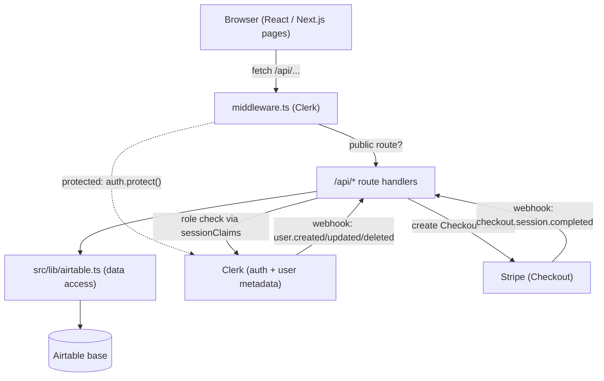

# Architecture

PITMSTR is the competition platform for the National High School BBQ Association (NHSBBQA), deployed at `highschoolbbqleague.com`. This section explains how the pieces fit together so a developer taking over cold can reason about the whole system.

## The one-paragraph version

PITMSTR is a single Next.js 16 App Router application (TypeScript, React 19) that serves both the public-facing pages and the JSON API from the same codebase. Authentication is handled by Clerk; user roles live in Clerk `publicMetadata` and are mirrored into Airtable. Airtable is the system of record: every event, team, school, student, score, and invoice is an Airtable record. The app never talks to Airtable from the browser. Instead, React components call internal API routes under `/api/*`, and those route handlers use the data-access layer in `src/lib/airtable.ts`. Payments run through Stripe Checkout, and Stripe plus Clerk both call back into the app via webhooks. The whole thing deploys to Vercel as serverless functions.

## Major subsystems

| Subsystem | Lives in | Responsibility |
|---|---|---|
| Pages and UI | `src/app/**/page.tsx`, `src/components/` | Public site (leaderboard, events, teams, schools), role dashboards, admin console, QR scan forms |
| API layer | `src/app/api/**/route.ts` | All reads and writes. Validates input, checks permissions, calls the data layer |
| Auth and RBAC | `src/middleware.ts`, `src/lib/auth.ts`, `src/lib/roles.ts` | Route protection, role extraction from the Clerk session, permission checks |
| Data access | `src/lib/airtable.ts` | Every Airtable CRUD call, lookup caching, record-to-type mapping |
| Scoring engine | `src/lib/scoring.ts` | The NHSBBQA M.E.A.T. scoring math, ranking, and tie-breaking |
| QR flows | `src/lib/qr.ts`, `src/app/scan/**` | QR generation for check-in and turn-in, plus the judge scoring form |
| Billing | `src/lib/stripe.ts`, `src/app/api/billing/**`, `src/app/api/webhooks/stripe` | Stripe Checkout sessions and invoice payment reconciliation |
| PDF / reports | `src/lib/pdf/`, `src/app/api/reports/**` | Invoices, event result sheets, QR turn-in sheets, payment packages |

## How a feature typically works

Most features follow the same path, which is worth internalizing:

1. A page or client component issues `fetch("/api/<thing>")`.
2. `src/middleware.ts` decides whether the route is public or needs a signed-in user.
3. The route handler in `src/app/api/<thing>/route.ts` runs. For writes it calls `requirePermission(...)` from `src/lib/auth.ts`.
4. The handler calls a function in `src/lib/airtable.ts`, which reads or writes Airtable.
5. The handler returns JSON shaped as `{ success: boolean, data?, error? }`.

For the full step-by-step trace, see [Request and Data Flow](request-flow.md). For the building blocks in detail, see [System Overview](system-overview.md). For every library and why it is present, see [Tech Stack](tech-stack.md).

!!! note "Airtable is canonical, there is no separate database"
    There is no Postgres, Prisma, or ORM. Airtable tables are the database. The `src/lib/airtable.ts` module is the closest thing to a data layer, and table and field names are hard-coded strings that must match the live base exactly.
