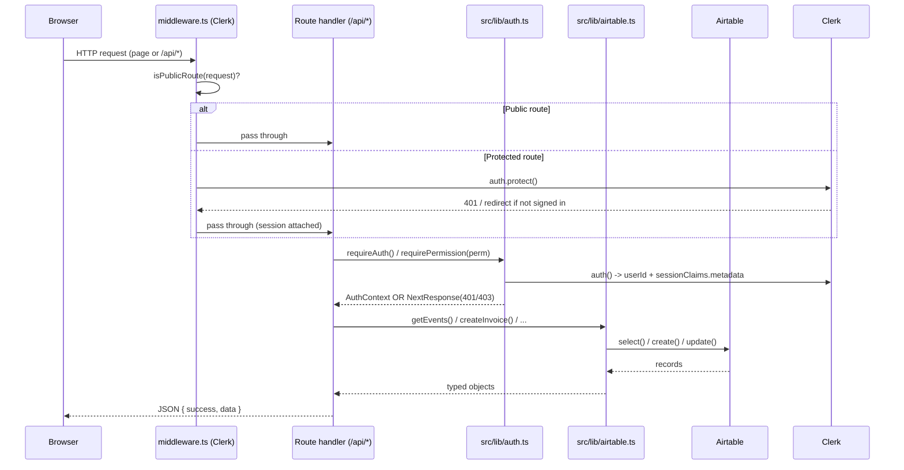

# Request & Data Flow

This page traces a single request end to end: from a click in the browser, through Next.js middleware and a route handler, into Clerk and Airtable, and back out as JSON. Two concrete examples follow the general model.

## The general path

### Step by step

1. **Browser issues a request.** Either a navigation to a page or a `fetch("/api/...")` from a Client Component (for example the leaderboard page fetching `/api/events`).
2. **Middleware runs first.** `src/middleware.ts` wraps the app in `clerkMiddleware`. It checks the request against `isPublicRoute`, an allowlist created with `createRouteMatcher`. Public entries include `/`, `/leaderboard(.*)`, `/events(.*)`, `/teams(.*)`, `/schools(.*)`, `/knowledge-base(.*)`, `/scan(.*)`, `/pay(.*)`, the public read APIs (`/api/events`, `/api/leaderboard`, `/api/stats`, `/api/teams`, `/api/schools`, `/api/scoring`), and both webhook endpoints. Anything not on the list triggers `await auth.protect()`, which forces a signed-in session or returns 401 / redirects to sign-in.
3. **Route handler executes.** For an API call this is `src/app/api/<thing>/route.ts`. Read handlers usually skip auth. Write and admin handlers call `requireAuth()` or `requirePermission()` from `src/lib/auth.ts`.
4. **Auth context is derived.** `getAuthContext()` calls Clerk's `auth()` and reads `sessionClaims.metadata` for `role`, `schoolId`, and `stateId`. `requirePermission()` then checks `hasPermission(role, permission)` against the map in `src/lib/roles.ts`. On failure it returns a `NextResponse` with 401 (not signed in) or 403 (signed in but lacking permission). The `isAuthError()` type guard lets handlers short-circuit on that response.
5. **Data layer is called.** The handler invokes a function in `src/lib/airtable.ts`. That function lazily builds the Airtable client, warms the lookup caches if needed, runs `select`/`find`/`create`/`update`/`destroy`, and maps the raw records into typed objects from `src/lib/types.ts`.
6. **Response is returned.** Handlers return `NextResponse.json({ success, data })`. Some read endpoints add `Cache-Control` headers so Vercel's edge can serve repeat hits without touching Airtable.

## Example A: viewing a leaderboard (public, read)

1. The user opens `/leaderboard`. It is public, so middleware passes it straight through.
2. The page is a Client Component; it `fetch`es `/api/events` to list events. `/api/events` is public.
3. The user clicks an event, landing on `/leaderboard/[eventId]`, which fetches `/api/leaderboard?eventId=...`.
4. `src/app/api/leaderboard/route.ts` calls `getEventLeaderboard(eventId, category)` in `src/lib/airtable.ts`.
5. That function reads the event's linked `Teams`, pulls `BBQ Report Cards`, aggregates per-team and per-category scores, sorts by score, assigns ranks, and returns `LeaderboardEntry[]`.
6. The handler returns the JSON with `Cache-Control: public, s-maxage=10, stale-while-revalidate=30`, so during a live event repeated views are served from the edge for up to ten seconds.

## Example B: a judge submitting a score (public, write)

1. A judge scans a turn-in QR code and lands on `/scan/turnin/[eventId]/[teamId]/[category]`. The `/scan(.*)` prefix is public, so no login is required.
2. The form (`page.tsx`) collects the M, E, A, T component scores and the judge name, then `POST`s to `/api/scoring/submit`.
3. `src/app/api/scoring/submit/route.ts` validates shapes: event and team must match the `rec...` record-ID pattern, category and judge name must pass a safe-character regex (this prevents Airtable formula injection), and each score must sit inside its component range (M 0-10, E 0-55, A 0-15, T 0-20).
4. It looks up the Category and Judge record IDs by name (using validated values inside `filterByFormula`), then creates a row in the `BBQ Report Cards` table with the four component fields.
5. It returns `{ success: true, data: { id, totalScore } }`. The form advances to its success step.

!!! note "Writes that need permission vs. writes that do not"
    Judge score submission and the teacher and student self-link endpoints are intentionally reachable without admin rights (judges have no accounts; teachers self-link their own school once). Most other writes, creating events, teams, invoices, and changing roles, go through `requirePermission(...)` and are admin-only. The exact permission per route is in the API Reference.

## Webhooks (inbound, server to server)

Two endpoints are called by external services rather than users, which is why both are on the public allowlist:

- `POST /api/webhooks/clerk` verifies the Svix signature with `CLERK_WEBHOOK_SECRET` and, on `user.created` / `user.updated` / `user.deleted`, syncs the user into the Airtable `Users` table.
- `POST /api/webhooks/stripe` verifies the Stripe signature with `STRIPE_WEBHOOK_SECRET` and, on `checkout.session.completed`, marks the linked invoice `Paid`.
