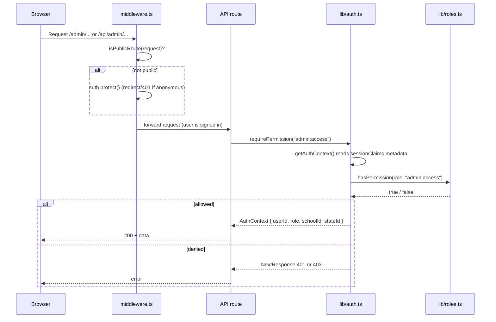

# Authentication & RBAC

How users sign in and how access is enforced per role.

PITMSTR uses [Clerk](https://clerk.com) for authentication and a small,
hand-rolled role-based access control (RBAC) layer on top of it. There is no
custom session store and no separate auth database: the signed-in user's role
travels inside the Clerk session token as a custom claim, and every protected
surface reads that claim to decide what the user may do.

## The three layers

Authorization in this codebase is enforced at three distinct layers. Knowing
which layer does what is the key to understanding the system.

| Layer | File | Responsibility |
|-------|------|----------------|
| Edge middleware | `src/middleware.ts` | Decides "signed in or not" for every request. Redirects anonymous users away from non-public routes. Does **not** check roles. |
| Route guards | `src/lib/auth.ts` | Server-side helpers (`requireAuth`, `requirePermission`) that API routes call to enforce "signed in" plus a specific permission. Returns a `401` or `403` `NextResponse` on failure. |
| Permission model | `src/lib/roles.ts` | The single source of truth for roles and the permission-to-role matrix. `hasPermission()` and `hasRole()` answer "can this role do X". |

!!! note "Middleware gates pages, route guards gate data"
    The middleware only enforces authentication (are you logged in). It does
    **not** enforce roles. Role enforcement happens in the API route handlers
    via `requirePermission`. A signed-in non-admin can therefore load the HTML
    shell of an admin page, but the API calls that page makes will return
    `403 Forbidden`. Treat the API layer as the real security boundary.

## End-to-end flow

The sequence below traces a single authenticated, role-checked request from
browser to data.



## Where the role comes from

1. A user signs up or signs in through Clerk (see [Clerk Setup](clerk.md)).
2. An admin assigns a role, which is written to the user's Clerk
   `publicMetadata` (via `PATCH /api/users/[userId]/role`) and mirrored into
   Airtable.
3. Clerk is configured to project that metadata into the session token as a
   `metadata` custom claim.
4. On each request, `getAuthContext()` in `src/lib/auth.ts` reads
   `sessionClaims.metadata` and returns a typed `AuthContext`:

   ```typescript
   export interface AuthContext {
     userId: string;
     role: Role | undefined;
     schoolId: string | undefined;
     stateId: string | undefined;
   }
   ```

5. Route handlers call `requirePermission(...)` which compares the role against
   the matrix in `src/lib/roles.ts`.

!!! warning "Verify: the custom claim must be configured in the Clerk dashboard"
    `getAuthContext()` reads `sessionClaims?.metadata`. For that claim to be
    present, the Clerk JWT session token template must be configured to emit a
    `metadata` claim sourced from `user.public_metadata`. This is a dashboard
    setting, not code. If roles ever read as `undefined` for everyone, check
    the Clerk session-token customization first.

## The roles at a glance

There are five roles plus an implicit "public" (unauthenticated) state. The
canonical list lives in `ROLES` in `src/lib/roles.ts`.

| Role constant | Value | Label |
|---------------|-------|-------|
| `ROLES.ADMIN` | `admin` | NHSBBQA Admin |
| `ROLES.TEACHER` | `teacher` | Teacher / School Admin |
| `ROLES.STUDENT` | `student` | Student |
| `ROLES.PARENT` | `parent` | Parent |
| `ROLES.STATE_DIRECTOR` | `state_director` | State Director |

The full capability breakdown is on the [Roles & Permissions](roles.md) page.

## Reading the rest of this section

- [Clerk Setup](clerk.md): provider wiring, sign-in / sign-up routes, the
  session-claim shape declared in `src/types/clerk.d.ts`, and the Clerk
  webhook that syncs users into Airtable.
- [Roles & Permissions](roles.md): every role and a complete permission matrix
  derived from `PERMISSIONS` in `src/lib/roles.ts`.
- [Middleware & Route Protection](middleware.md): the public-route matcher, how
  `requireAuth` / `requirePermission` work, and which routes are protected
  versus deliberately open.
