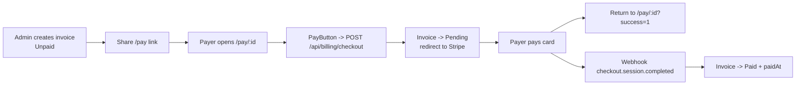

# Invoicing & Payments

This feature lets an NHSBBQA admin invoice a school for its team charters and lets the school pay online with a card. Charters are billed at `$250` per team (`CHARTER_FEE` in `src/lib/types.ts`). Invoices are Airtable records; Stripe is the payment rail. For the implementation details see [Billing & Stripe](../subsystems/billing-stripe.md).

## Roles in the flow

| Actor | Where | Does |
|---|---|---|
| NHSBBQA Admin | `/admin/billing` | Creates invoices, shares pay links, downloads PDFs, can manually change status |
| Payer (school / teacher / parent / sponsor) | `/pay/[invoiceId]` | Reviews the invoice and pays by card, no login required |
| Stripe | hosted checkout | Collects the card payment |
| App webhook | `/api/webhooks/stripe` | Marks the invoice paid when Stripe confirms |

## 1. Admin creates an invoice

From the billing dashboard at `/admin/billing` an admin creates an invoice tied to a charter. Invoice fields (from the `Invoice` interface in `src/lib/types.ts`) include:

- `invoiceNumber`, `charterId` / `charterName`
- `billingContact`, `billingEmail`, `billingPhone`
- `payerType` (Teacher, Office Admin, CTE Director, Parent, Sponsor, In-Kind Donor)
- `paymentMethod` (Check, Credit Card, Purchase Order)
- `aeuType` (the school's agency type, e.g. School District, Independent School District)
- `totalAmount`, `taxExempt` / `taxExemptNumber`, `notes`
- `paymentStatus` and `paidAt`

New invoices start at `paymentStatus: "Unpaid"`. The dashboard lists invoices and exposes per-row actions: download invoice PDF, download payment package, copy pay link, and (for unpaid invoices) open the pay page.

The "copy pay link" action builds the public URL client-side:

```ts
const url = `${window.location.origin}/pay/${invoiceId}`;
```

The admin sends that link to whoever is paying.

## 2. Payer opens the pay page

`/pay/[invoiceId]` (`src/app/pay/[invoiceId]/page.tsx`) is a public, server-rendered page (`export const dynamic = "force-dynamic"`). It loads the invoice with `getInvoice(invoiceId)` and `notFound()`s if it does not exist. No authentication is required, the link itself is the access token.

The page shows the invoice number, amount due, charter, billed-to contact, payer type, and current status. It reads two query flags returned from Stripe:

- `?success=1` or a `paymentStatus` of `Paid` renders a green "Payment received" confirmation.
- `?canceled=1` (when not already paid) renders an amber "Payment canceled" notice with an invitation to retry.

If the invoice is not paid, it renders the `PayButton` client component plus "Secure checkout / Powered by Stripe" trust badges.

## 3. Payer starts checkout

`PayButton` (`src/app/pay/[invoiceId]/PayButton.tsx`) POSTs to the checkout endpoint and redirects the browser to the Stripe-hosted page:

```ts
const res = await fetch("/api/billing/checkout", {
  method: "POST",
  headers: { "Content-Type": "application/json" },
  body: JSON.stringify({ invoiceId }),
});
const json = await res.json();
if (!json.success || !json.url) throw new Error(json.error || "Unable to start checkout");
window.location.href = json.url;
```

While redirecting, the button shows a spinner ("Redirecting to Stripe..."). Errors render inline.

Behind that call, `/api/billing/checkout` creates a Stripe Checkout Session for the invoice total and flips the invoice to `Pending`. Full reference: [API: billing](../api/billing.md).

## 4. Payment confirmed

After the card is charged, Stripe redirects the payer back to `/pay/{invoiceId}?success=1` and, separately, fires a `checkout.session.completed` webhook to `/api/webhooks/stripe`. The webhook is the source of truth: it sets `paymentStatus: "Paid"`, stamps `paidAt`, and records `paymentMethod: "Credit Card"`. The admin dashboard then shows the invoice as paid.



## Status meanings

| Status | When |
|---|---|
| `Unpaid` | Invoice created, no payment attempted |
| `Pending` | Checkout session created, payment in flight |
| `Paid` | Stripe webhook confirmed the charge |
| `Refunded` | Set manually by an admin |

## Edge cases handled

- **Already paid:** the checkout endpoint returns `400` if `paymentStatus === "Paid"`, so a stale link cannot double-charge. The pay page also hides the pay button for paid invoices.
- **Canceled checkout:** returning with `?canceled=1` leaves the invoice as-is (it stays `Pending`) and prompts the payer to try again.
- **Pending write fails:** if flipping to `Pending` fails, checkout still proceeds; the webhook will mark `Paid` regardless.

!!! warning "Verify: a canceled payment leaves the invoice on Pending"
    The checkout route sets `Pending` before redirecting and nothing resets it to `Unpaid` if the payer cancels. The invoice will read `Pending` until either a successful webhook flips it to `Paid` or an admin changes it manually. Confirm this matches how the team reads the dashboard.

## Related pages

- [Billing & Stripe](../subsystems/billing-stripe.md) - implementation and webhook lifecycle.
- [API: billing](../api/billing.md) - checkout endpoint.
- [Reports & Certificates](reports.md) - invoice and payment-package PDFs.
