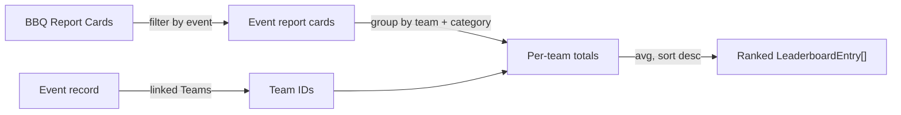

# Leaderboard

The public leaderboard turns judge scores stored in Airtable into ranked standings. It is read-only and available to everyone.

## Where it lives

| Page | Route | Purpose |
|---|---|---|
| `src/app/leaderboard/page.tsx` | `/leaderboard` | Pick an event (live, completed, upcoming) |
| `src/app/leaderboard/[eventId]/page.tsx` | `/leaderboard/:eventId` | Standings for one event |
| `src/app/leaderboard/[eventId]/team/[teamId]/page.tsx` | nested | One team's detail within an event |

The data comes from `GET /api/leaderboard?eventId=...&category=...` (`src/app/api/leaderboard/route.ts`), which calls `getEventLeaderboard()` in `src/lib/airtable.ts`.

## The event picker

`/leaderboard` is a Client Component that fetches `/api/events` and groups results into **Live Now**, **Completed Events**, and **Upcoming Events** (upcoming leaderboards are shown but flagged as available once live). It offers a search box, a division filter, and an A-Z filter. Each card links to that event's leaderboard. Event status is computed from the date (see [Events and Teams](events-teams.md)).

## How standings are computed

`getEventLeaderboard(eventId, category = "Overall")` does the following:

1. Loads the event record and reads its linked **Teams** (the field `Teams`). If none, returns an empty board.
2. Fetches **BBQ Report Cards** (up to 1000) and keeps the ones linked to this event.
3. For each report card it reads **Total Score** and the linked **Category**, then accumulates per team: a running total and count, plus per-category totals and counts.
4. If a specific category is requested (anything other than `Overall`), report cards for other categories are skipped.
5. For each team it computes `score = total / count` (an average across the counted report cards), rounds to two decimals, and builds a `LeaderboardEntry` with team, school, state, and division.
6. Entries are sorted by `score` descending, and ranks are assigned 1..N by position.

!!! note "Two scoring paths exist"
    The leaderboard's averaging in `getEventLeaderboard()` (sum of Total Score / count) is simpler than the full M.E.A.T. engine in `src/lib/scoring.ts` (drop-lowest per component, weighting, deterministic tie-break). The live leaderboard uses the Airtable-stored `Total Score` per report card and averages them. The richer `scoring.ts` ranking (including `tieBreakIndex`) is the canonical competition math and is used by the scoring subsystem and reports. If standings ever look different between the leaderboard and an official report, this difference is why. See [Scoring Engine](../subsystems/scoring-engine.md).

## Caching for live events

The leaderboard API sets `Cache-Control: public, s-maxage=10, stale-while-revalidate=30`. During a live event repeated views are served from Vercel's edge for up to ten seconds, then revalidated. This keeps judge submissions reflected near-real-time without hammering Airtable on every page view.

## Role scoping

The leaderboard itself is public and identical for all viewers, there is no per-role filtering of standings. Role-specific access shows up around it:

- **Public and pending users** reach `/leaderboard` directly (it is on the public route allowlist in `src/middleware.ts`).
- **Teachers** get a "Scores / View leaderboard" quick action on `/dashboard/school`.
- **Students and parents** are pointed to the leaderboard from `/dashboard/my` for live scores.
- **Admins** generate official result PDFs from `/admin/reports` rather than reading the public board.

!!! warning "Verify: category leaderboards in the UI"
    The API accepts a `category` parameter and filters accordingly, but confirm whether the event leaderboard page exposes a category selector in the UI or only ever requests `Overall`. The aggregation supports per-category standings; surfacing them may be a small UI addition.

## Display building blocks

Standings rows and badges are rendered with shared components: `LeaderboardRow`, `RankBadge`, `DivisionBadge`, and `StateFlag` from `src/components/`. Division names render via the official `[ACRONYM] Division` convention; do not regress to legacy strings.
