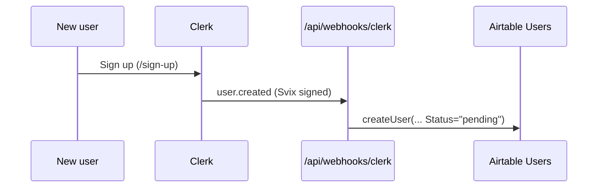

# Registration & School Activation

How a person becomes a user, gets a role, and links to a school or team. This is an admin-approval model: anyone can sign up, but an NHSBBQA admin assigns the role that unlocks a dashboard.

## The actors

- **A new user** signs up through Clerk.
- **An NHSBBQA admin** assigns a role (and optionally a school or state) from the admin User Management screen.
- **Teachers, students, and parents** then self-link to their school or team once, a one-time setup step.

## Step 1: Sign up (Clerk)

Sign-up happens at `/sign-up` (`src/app/sign-up/[[...sign-up]]/page.tsx`), which renders Clerk's `<SignUp />` component. Clerk handles OTP and social login. No application logic runs here beyond Clerk's own flow.

When Clerk creates the account it fires a `user.created` webhook to `POST /api/webhooks/clerk` (`src/app/api/webhooks/clerk/route.ts`). The handler:

1. Verifies the Svix signature with `CLERK_WEBHOOK_SECRET`.
2. Calls `createUser(clerkId, email, firstName, lastName)` in `src/lib/airtable.ts`, which inserts a row in the Airtable `Users` table with `Status: "pending"` and no role.

So immediately after sign-up the user exists in both Clerk and Airtable, but has no role.

## Step 2: Pending state

With no role, visiting `/dashboard` runs the router in `src/app/dashboard/page.tsx`. The `switch (role)` has no matching case, so it redirects to `/dashboard/pending` (`src/app/dashboard/pending/page.tsx`). That screen tells the user their account was created and "an NHSBBQA administrator will review and activate your account shortly." It offers links to browse the leaderboard or sign out.

!!! note "No automatic notification on activation"
    The pending screen says the user will be notified once activated, but there is no code that sends an activation email. Notification, if any, is manual. Flagged so you do not assume an automated email exists.

## Step 3: Admin assigns a role (activation)

An admin opens **User Management** (`/admin/users`). It lists Clerk users via `GET /api/users` (admin-only, `users:manage` permission) showing name, email, sign-up and last-sign-in dates, and current role. The admin sets a role from a dropdown, which calls `PATCH /api/users/[userId]/role` (`src/app/api/users/[userId]/role/route.ts`).

That handler:

1. Requires the `users:manage` permission.
2. Validates the role against `ROLES` in `src/lib/roles.ts`.
3. Merges the new `role` (and optional `schoolId` / `stateId`) into the user's Clerk `publicMetadata` (preserving existing fields).
4. Mirrors the change into Airtable via `updateUserRole(...)`, which also sets the Airtable `Status` to `"active"`.
5. Writes an audit-log entry (`role.assigned`).

Once the role is in Clerk `publicMetadata`, the next time the user's session refreshes, `/dashboard` routes them to the right place: teacher to `/dashboard/school`, student or parent to `/dashboard/my`, state director to `/dashboard/state`, admin to `/admin`.

## Step 4: Self-link to a school or team

Role assignment alone does not connect a teacher to a specific school or a student to a team. That is a one-time self-link the user performs from their dashboard.

### Teacher links a school

On `/dashboard/school` (`src/app/dashboard/school/page.tsx`), if the teacher has no `schoolId` in metadata, the page fetches `/api/schools` and shows a school picker. Selecting one calls `PATCH /api/users/[userId]/school` (`src/app/api/users/[userId]/school/route.ts`). That handler enforces:

- The caller can only link their own account (`authResult.userId === userId`).
- The caller must have the `teacher` role.
- They must not already have a school linked (to change it later, an admin must do it).

It writes `schoolId` into Clerk metadata and mirrors it to Airtable, then the page reloads to pick up the new session. After linking, the dashboard shows the school's charter status, team count, and team list (fetched from `/api/schools/[schoolId]`).

### Student or parent links a team

On `/dashboard/my` (`src/app/dashboard/my/page.tsx`), a student or parent with no `teamId` sees a team picker fed by `/api/teams`. Selecting one calls `PATCH /api/users/[userId]/team`, after which the dashboard shows the team, school, and teammates (from `/api/teams/[teamId]`).

## Where schools and teams come from

Schools are records in the Airtable **Charter** table; teams are in the **Teams** table. They are created by admins (teams via `POST /api/teams` from the admin Teams screen), not by self-service registration. A teacher self-links to an existing charter; they do not create one through the app.

!!! warning "Verify: school request flow"
    `src/lib/roles.ts` defines a `schools:request` permission for teachers and `schools:activate` for admins, implying a "request a new charter" flow. No API route implements `schools:request` today, charters are created in Airtable / by admins. If a self-service charter request is expected, it is not yet built.

## Roles and what unlocks

| Role | Self-link target | Dashboard after linking |
|---|---|---|
| teacher | School (Charter) | `/dashboard/school` with teams and charter status |
| student | Team | `/dashboard/my` with teammates and results |
| parent | Team | `/dashboard/my` (scoped to their student's team) |
| state_director | (admin assigns state) | `/dashboard/state` (stub) |
| admin | n/a | `/admin` |

For the permission matrix behind all of this, see [Roles and Permissions](../auth-rbac/roles.md).
