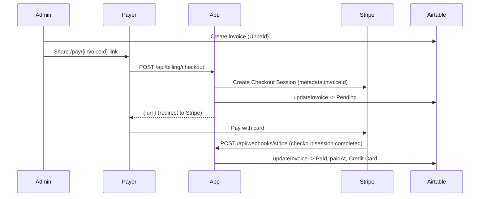

# Billing & Stripe

This subsystem charges schools for team charters through Stripe Checkout. The Airtable "Invoices" table is the system of record for payment status; Stripe is only the payment rail. There are three moving parts:

1. A thin Stripe client helper (`src/lib/stripe.ts`).
2. A checkout endpoint that turns an invoice into a hosted Stripe Checkout Session (`src/app/api/billing/checkout/route.ts`).
3. A webhook endpoint that listens for the completed payment and writes the result back to Airtable (`src/app/api/webhooks/stripe/route.ts`).

## The Stripe client

`src/lib/stripe.ts` exposes a lazily-instantiated singleton so the SDK is only constructed when a secret key is present.

```ts
let client: Stripe | null = null;

export function getStripe(): Stripe {
  if (!client) {
    const key = process.env.STRIPE_SECRET_KEY;
    if (!key) throw new Error("STRIPE_SECRET_KEY is not set");
    client = new Stripe(key, { apiVersion: "2026-03-25.dahlia" });
  }
  return client;
}

export function isStripeConfigured(): boolean {
  return !!process.env.STRIPE_SECRET_KEY;
}
```

!!! warning "Pinned API version"
    The client pins Stripe API version `2026-03-25.dahlia`. If you upgrade the `stripe` npm package, confirm this version string is still valid or update it deliberately.

| Env var | Used by | Purpose |
|---|---|---|
| `STRIPE_SECRET_KEY` | `getStripe()` | Server-side Stripe API key |
| `STRIPE_WEBHOOK_SECRET` | webhook route | Verifies inbound webhook signatures |

## Checkout session creation

`POST /api/billing/checkout` accepts `{ invoiceId }` and returns `{ success, url }`. Full endpoint reference: [API: billing](../api/billing.md).

Flow inside the handler:

1. Read `invoiceId` from the JSON body. Missing id returns `400`.
2. `getInvoice(invoiceId)` from Airtable. Not found returns `404`.
3. If `invoice.paymentStatus === "Paid"`, return `400` ("Invoice already paid"). This blocks double payment.
4. Resolve the `origin` for return URLs from `request.nextUrl.origin`, falling back to `NEXT_PUBLIC_APP_URL`, then `NEXT_PUBLIC_BASE_URL`, then `https://highschoolbbqleague.com`.
5. Create a Checkout Session:

```ts
const session = await stripe.checkout.sessions.create({
  mode: "payment",
  payment_method_types: ["card"],
  customer_email: invoice.billingEmail || undefined,
  line_items: [
    {
      price_data: {
        currency: "usd",
        product_data: {
          name: `NHSBBQA Charter - ${invoice.charterName || "Team Charter"}`,
          description: `Invoice ${invoice.invoiceNumber}`,
        },
        unit_amount: Math.round(invoice.totalAmount * 100),
      },
      quantity: 1,
    },
  ],
  metadata: {
    invoiceId: invoice.id,
    invoiceNumber: invoice.invoiceNumber,
  },
  success_url: `${origin}/pay/${invoice.id}?success=1`,
  cancel_url: `${origin}/pay/${invoice.id}?canceled=1`,
});
```

Key details:

- A single dynamic `price_data` line item is built on the fly from `invoice.totalAmount`. There is no pre-created Stripe Price or Product. `unit_amount` is the invoice total in cents (`Math.round(totalAmount * 100)`).
- The product `name` template literal in the actual source uses an em-dash separator between "NHSBBQA Charter" and the charter name; it is shown here with a plain hyphen.
- `metadata.invoiceId` is the link the webhook later uses to find the Airtable record. This is the critical handoff between Stripe and the app.
- Both `success_url` and `cancel_url` point back at the public pay page `/pay/{invoiceId}` with a query flag.
- After the session is created, the invoice is flipped to `Pending` so the admin dashboard reflects an in-flight payment. This write is wrapped in a `try/catch` and is intentionally non-fatal:

```ts
try {
  await updateInvoice(invoice.id, { paymentStatus: "Pending" });
} catch {
  // non-fatal; webhook will mark Paid on completion
}
```

If `session.url` is missing, the route returns `500`.

!!! note "No auth guard on checkout"
    `/api/billing/checkout` has no `requirePermission` guard. It is called from the public `/pay/[invoiceId]` page so that schools who receive a payment link (without a login) can pay. The reports endpoints, by contrast, are admin-gated.

## Webhook lifecycle

`POST /api/webhooks/stripe` is the endpoint Stripe calls when events fire. It is configured to run on the Node.js runtime (`export const runtime = "nodejs"`) because signature verification needs the raw request body.

```ts
const signature = request.headers.get("stripe-signature");
const secret = process.env.STRIPE_WEBHOOK_SECRET;
if (!signature || !secret) {
  return NextResponse.json({ error: "Missing signature or webhook secret" }, { status: 400 });
}

const rawBody = await request.text();
const stripe = getStripe();

let event: Stripe.Event;
try {
  event = stripe.webhooks.constructEvent(rawBody, signature, secret);
} catch (err) {
  // signature verification failed -> 400
}
```

Only one event type is handled: `checkout.session.completed`. When that arrives and the session's `payment_status` is `"paid"` and `metadata.invoiceId` is present, the invoice is marked paid:

```ts
if (event.type === "checkout.session.completed") {
  const session = event.data.object as Stripe.Checkout.Session;
  const invoiceId = session.metadata?.invoiceId;

  if (invoiceId && session.payment_status === "paid") {
    await updateInvoice(invoiceId, {
      paymentStatus: "Paid",
      paidAt: new Date().toISOString(),
      paymentMethod: "Credit Card",
    });
  }
}

return NextResponse.json({ received: true });
```

Any other event type is acknowledged with `{ received: true }` and ignored. Handler errors return `500` (which tells Stripe to retry).

## Invoice payment lifecycle

Payment status lives on the Airtable invoice record. The allowed values come from `PAYMENT_STATUSES` in `src/lib/types.ts`:

| Status | Set by | Meaning |
|---|---|---|
| `Unpaid` | Invoice creation (admin) | New invoice, nothing started |
| `Pending` | Checkout route, after session is created | Payment in flight at Stripe |
| `Paid` | Stripe webhook on `checkout.session.completed` | Payment confirmed; `paidAt` and `paymentMethod: "Credit Card"` written |
| `Refunded` | Manual admin change | Returned to payer (no automated refund flow exists) |



!!! warning "Verify: refunds and admin overrides"
    The webhook does not handle `charge.refunded` or any refund event. `Refunded` status is only reachable through the admin billing UI (`/api/admin/invoices` PATCH). Likewise an admin can manually flip status from the billing dashboard. Confirm these manual paths match your operational process before relying on `Refunded`.

## Related pages

- [Invoicing & Payments](../features/billing.md) - the end-user and admin flow.
- [API: billing](../api/billing.md) - checkout endpoint reference.
- [Reports & Certificates](../features/reports.md) - invoice and payment-package PDFs.
